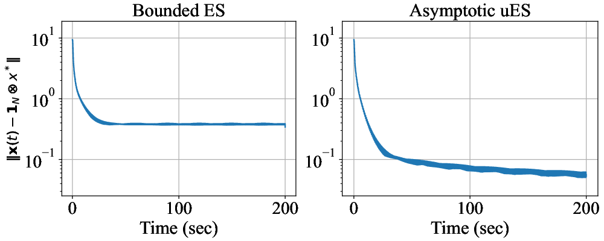
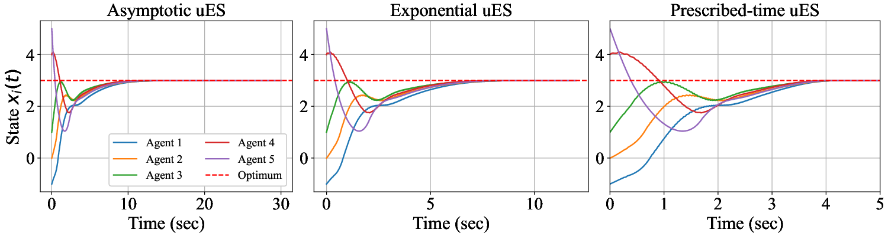
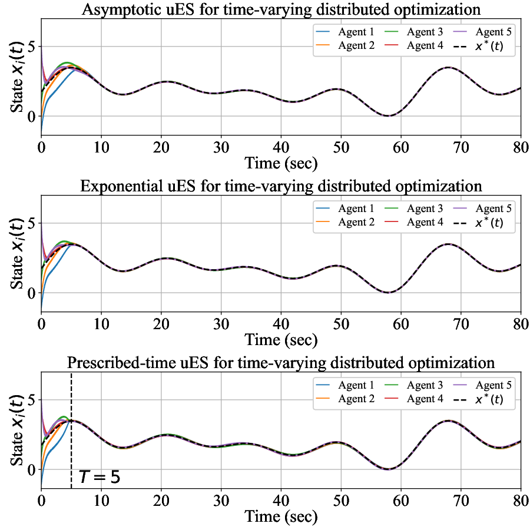
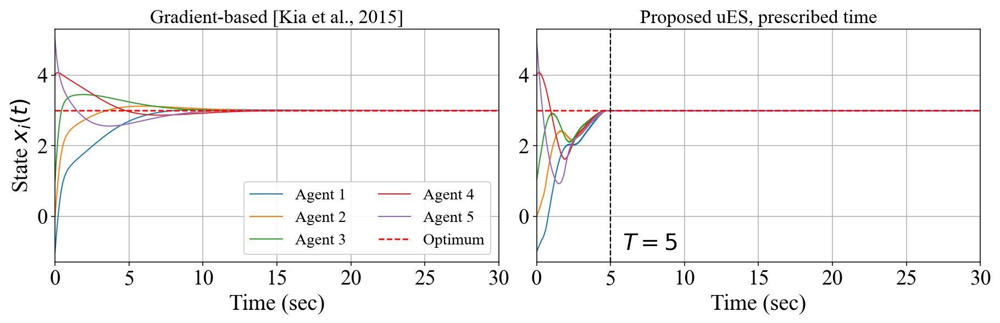
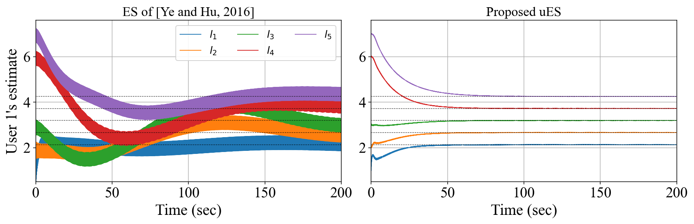

# Distributed Time-Varying Optimization via Unbiased Extremum Seeking — Simulation Code

This repository contains the Python code that reproduces all numerical results
in the paper:

> X. Li, X. Yang, E. Fridman, M. Diagne, and J. Sun,
> "Distributed Time-Varying Optimization via Unbiased Extremum Seeking,"
> submitted to *IEEE Transactions on Control of Network Systems* (TCNS).

The framework is a distributed, continuous-time, **gradient-free** scheme based
on **unbiased extremum seeking (uES)**: $N$ agents cooperatively track the
optimum $x^{*}(t)$ of a time-varying sum cost $f(x, \zeta(t)) = \sum f_i(x, \zeta(t))$ using
only real-time function measurements, over a weight-balanced, strongly connected
directed graph. A time-scaling ("chirpy") probing mechanism unifies
asymptotic, exponential, and prescribed-time convergence.

## Requirements

- Python ≥ 3.9
- `numpy`, `scipy`, `matplotlib` (figures)
- `cvxpy` with a SDP solver such as CLARABEL or SCS (only for `LMI/`)

```bash
pip install -r requirements.txt
```

## Layout

```
.
├── *.py          # figure-generating scripts (see the map below)
├── out/          # generated figures (.eps / .png), tracked for convenience
├── fig/          # PNG snapshots for this README
└── LMI/          # LMI feasibility checks for Proposition 1 + parameter search
```

## Script → figure map

| script | outputs (`out/`) | reported in |
|---|---|---|
| `fig2_beta_3d.py` | `beta3d=0.eps`, `beta3d=1.eps` | **Fig. 2**(b)(c) of the paper |
| `fig4_chirpy_invariant.py` | `chirpy_{asy,exp,pt}_invariant.eps` | **Fig. 3** of the paper |
| `fig5_chirpy_varying.py` | `chirpy_{asy,exp,pt}_varying.eps` | **Fig. 4** of the paper |
| `compare_gradient_kia2015.py` | `compare_gradient.{eps,png}` | response letter, Fig. R1 |
| `compare_es_yehu2016.py` | `compare_es_smartgrid.{eps,png}` | response letter, Fig. R2 |
| `fig3_beta.py` | `beta=0.eps`, `beta=1.eps` | *superseded* — scalar version of Fig. 2 |
| `global_optimization.py` | — | cost-landscape exploration, not a figure |

Fig. 1 (block diagram) and the topology panel of Fig. 2 are drawn separately and
are not produced here.

## Reproducing the figures

```bash
pip install -r requirements.txt
python fig2_beta_3d.py             # -> out/beta3d=0.eps, out/beta3d=1.eps
python fig4_chirpy_invariant.py    # -> out/chirpy_*_invariant.eps
python fig5_chirpy_varying.py      # -> out/chirpy_*_varying.eps
python compare_gradient_kia2015.py # -> out/compare_gradient.{eps,png}
python compare_es_yehu2016.py      # -> out/compare_es_smartgrid.{eps,png}
```

Each script writes its figures into `out/`.

## LMI feasibility (`LMI/`)

`LMI/check_lmi.py` verifies the three LMIs of Proposition 1 as a semidefinite
program and reports a feasibility margin for the parameter sets used in the
paper, together with sweeps over `gamma` and `v`. All three paper figures use **strictly LMI-feasible** gains —
margins Fig. 2 $+0.0126$, Fig. 3 $+0.0140$, Fig. 4 $+0.244$ / $+0.282$. See
[`LMI/README.md`](LMI/README.md) for the certificates and usage.

---

# The examples

Common to every example: $N = 5$ agents on the **directed ring**
$1 \to 2 \to 3 \to 4 \to 5 \to 1$, which is weight-balanced and strongly connected,
as Assumption 3 requires. Only the Ye–Hu baseline in Example 5 needs a different
graph, because its analysis is restricted to undirected ones.

## 1. Constant-frequency probing, $d = 3$ (Fig. 2 of the paper)

`fig2_beta_3d.py` — the unbiasing mechanism switched on and off.

Cost $f_i(x) = \|x - c_i\|^2 + \ln(1 + \|x - c_i\|^2)$ on $\mathbb{R}^3$, with the $c_i$
the columns of

```
[1 2 3 4 5]          [-1  0  1  4  5]
[2 1 3 2 4]   x(0) =  [ 0  3 -1  5  1]
[1 3 2 4 3]           [ 2 -1  4  0  5]
```

so $x^{*} \approx (3, 2.4124, 2.5876)$. Gains $v = 2$, $k = 1$, $\gamma = 0.1$,
$\alpha = 0.4$, $\omega_h = 10$, $\omega = 10$, $\hat{\omega} = (3, 5, 7)$. LMI
certificate $p_{11} = 2.325$, $p_{22} = 1$, $\delta = 0.0719$; margin $+0.0126$.

$\beta = 0$ gives $\xi(t) \equiv 1$, which reduces the algorithm to bounded ES
(Scheinker–Krstić) with PI consensus — a published scheme, not a variant of
ours — and $\beta = 0.2$ is the proposed uES.



| | error at $t = 400$ |
|---|---|
| $\beta = 0$ (bounded ES + PI consensus) | $3.3\times 10^{-1}$, stalled |
| $\beta = 0.2$ (proposed uES) | **$4.2\times 10^{-2}$**, still decreasing |

The point is not the ratio but the *shape*: the left curve reaches a floor set
by the constant probing amplitude, the right one does not settle on one.

## 2. Chirpy probing, time-invariant extremum (Fig. 3 of the paper)

`fig4_chirpy_invariant.py` — the three convergence modes of Table I.

Cost $f_i(x) = (x - i)^2 + \ln(1 + (x - i)^2)$, $i = 1,\dots,5$, $d = 1$, minimised at
$x^{*} = 3$; $x(0) = [-1, 0, 1, 4, 5]$. Shared gains $q = 2$, $k = 32$,
$\alpha = 0.0125$ (so $\alpha k = 0.4$), $\gamma = 0.05$, $\omega = 40$,
$\omega_h = 8$. All three configurations have $\rho = 5$, hence
$1/(q\rho) = 0.1$, and therefore share one LMI certificate
($p_{11} = 2.375$, $p_{22} = 1$, $\delta = 0.0733$), margin $+0.0140$.

| panel | $\phi(t)$ | parameters | $p$ | horizon |
|---|---|---|---|---|
| asymptotic | $(1 + \beta t)^{1/v}$ | $\beta = 0.05$, $v = 0.5$ | 0.5 | 60 s |
| exponential | $e^{\lambda t}$ | $\lambda = 0.1$ | 1 | 24 s |
| prescribed-time | $(T/(T - t))^{1/\varrho}$ | $T = 10$, $\varrho = 1$ | 2 | 10 s |



Final errors $2.8\times 10^{-3}$ / $2.5\times 10^{-3}$ / $1.5\times 10^{-3}$. $\phi$ is capped only in the
prescribed-time panel (at $t = 9$, unavoidable since $\phi \to \infty$ as
$t \to T$); the horizons of the other two are short enough that their caps never
activate.

$\rho$ is what sets every time constant of the run, so the three horizons scale
with it. For this cost family $1/(q\rho) = 0.1$ is what the LMIs admit (see
`LMI/README.md`), and the horizons above are simply what that growth rate needs
to bring the error down.

## 3. Chirpy probing, time-varying extremum (Fig. 4 of the paper)

`fig5_chirpy_varying.py` — tracking a moving optimum.

Local minimisers $x_i^{*}(t) = c_i + A_i \sin(\omega_i t)$ with
$c = (0.75, 1.25, 1.75, 2.25, 2.75)$, $A = (0.6, 1.8, 3.0, 2.4, 3.0)$,
$\omega = (0.1, 0.2, 0.3, 0.1, 0.4)$, so $f_i(x,t) = (x - x_i^{*}(t))^2$ and the global
optimum $x^{*}(t)$ sweeps $[0, 3.5]$ — the same range as the initial spread
$x(0) = [-1, 0, 1, 4, 5]$, which is what keeps the tracking visible. Gains
$k = 1$, $\alpha = 1.6$, $\gamma = 0.05$, $\omega = 400$, $\omega_h = 8$.

The targets have bounded but non-decaying derivatives, so $c = 0$ in Assumption
2 and Theorem 2 needs $c - p < -2$, i.e. $p > 2$. Hence $q = 4$ for the
asymptotic and exponential panels ($p = 2.5, 3$) and $q = 2$, $\varrho = 2$ for
the prescribed-time one ($p = 3$). Growth parameters $\beta = 0.1$, $v = 0.5$;
$\lambda = 0.2$; $T = 5$, so $1/(q\rho) = 0.2$ for the first two and $0.1$ for
the third. Margins $+0.244$ / $+0.244$ / $+0.282$; certificates
$p_{11} = 2.511$, $\delta = 1.697$ and $p_{11} = 2.519$, $\delta = 1.819$, both
at $p_{22} = 1$.

The costs here are pure quadratics, $m = M = 2$, so the $\delta M^{2}$ term of
$\Phi_{11}$ is loose and this example tolerates much larger gains than the two
above — $\alpha k = 1.6$ against $0.4$.



Tracking bias $0.049$ / $0.052$ / $0.058$ over the last $60\,\text{s}$. $\phi$ is capped at
$t = 4.5$ in the prescribed-time panel and at $11.3$ / $6.6\,\text{s}$ in the other two,
where the cap is placed on a common post-cap frequency of $80\,000\,\text{rad/s}$.

## 4. Against a gradient-based method

`compare_gradient_kia2015.py` — same problem as Example 2, run against

> S. S. Kia, J. Cortés, S. Martínez, *Distributed convex optimization via
> continuous-time coordination algorithms with discrete-time communication*,
> Automatica 55 (2015) 254–264, algorithm (4):
> $\dot{v} = \alpha\beta L x$,
> $\dot{x} = -\alpha\nabla\tilde{f}(x) - \beta L x - v$,
> $\sum_i v_i(0) = 0$.

Their law also covers strongly connected weight-balanced digraphs, so both
schemes run on the *same* directed ring — no graph has to be rebuilt. Gains
$\alpha = \beta = 1$; ours is the prescribed-time configuration with $T = 5$,
$\varrho = 2$, $q = 2$, $\alpha k = 0.4$, $\gamma = 0.05$, $\omega = 40$,
$\omega_h = 8$, i.e. $1/(q\rho) = 1/(\varrho T) = 0.1$ — the certified row of
`LMI/README.md`. Since $1/(q\rho)$ does not involve $q$, holding $T = 5$ forces
$\varrho = 2$ and hence $p = q + \varrho - 1 = 3$; $\phi$ is capped at $7.5$
(reached at $t = 4.91$), which puts the post-cap probing frequency at
$1.3\times 10^{5}\,\text{rad/s}$.



| | error at $t = 5$ | error at $t = 30$ |
|---|---|---|
| Kia et al. (gradient-based) | $3.74\times 10^{-1}$ | $5.07\times 10^{-5}$ |
| proposed uES, prescribed $T = 5$ | **$1.65\times 10^{-3}$** | $1.29\times 10^{-3}$ |

Their law evaluates $\nabla f_i$ and so needs the analytic expression of each
local cost; ours only samples the value $f_i(x_i)$. And their exponential rate
is fixed by the gains and cannot be *assigned*: at $t = T = 5$ ours is
$226\times$ closer, and their error does not reach ours until $t = 20.5$. Past
that the gradient method keeps improving and eventually wins on absolute
accuracy — it has exact gradients and no dither floor. That is the honest
trade-off and is worth stating rather than hiding.

## 5. Against a classical ES method, on its own smart-grid application

`compare_es_yehu2016.py` — the application example, run against

> M. Ye and G. Hu, *Distributed extremum seeking for constrained networked
> optimization and its application to energy consumption control in smart
> grid*, IEEE TCST 24(6) 2016, algorithm (8):
> $x_{ij} = \hat{x}_{ij} + b\sin(\omega_{ij} t)$,
> $\dot{\hat{x}}_{ij} = -k\bigl( f_i(\mathbf{x}_i)\sin(\omega_{ij} t) + \frac{b}{2}[ (L\hat{x})_{ij} + (Lz)_{ij} ]\bigr)$,
> $\dot{z}_{ij} = \theta\,(L\hat{x})_{ij}$.

Their Section VII: $N = 5$ users with HVAC systems agree on a consumption
profile $l \in \mathbb{R}^5$ (so $d = 5$, and every user estimates all five entries),
trading discomfort against a usage-dependent price,

```
f_i(l) = rho_i (l_i - lhat_i)^2 + ( k_p (sum_j l_j - L*) + p0 ) l_i
```

with $\rho = (5.2, 5.4, 5.6, 5.8, 6.0)$, $\hat{l} = (3, 3.5, 4, 4.5, 5)$,
$k_p = 0.5$, $p_0 = 1$, $L^{*} = 0.8\sum\hat{l}_i = 16$. Magnitudes are their Table I
divided by $40$ (and $p_0 = 10$ scaled to $1$) so the optimum is readable; the cost
is otherwise theirs unchanged. Social optimum
$l^{*} = (2.137, 2.669, 3.198, 3.726, 4.252)$, $x(0) = (1, 2, 3, 6, 7)$ for every
user.

Baseline gains $b = 0.3$, $k = 0.3$, $\theta = 0.045$, frequencies $\omega_{ij}$ the odd
multiples $3, 5, \dots, 51$ of $10\,\text{rad/s}$. Ours: asymptotic configuration,
$\beta = 0.1$, $v = 1$, $q = 2$, $\omega = 60$, $\alpha = 1.2$, $k = 0.5$,
$\gamma = 0.05$, $\omega_h = 8$; $\phi(200) = 21$, so no cap is needed.



| | error at $t = 200$ | swing over the last $20\,\text{s}$ |
|---|---|---|
| Ye and Hu (2016) | $6.66\times 10^{-1}$ | $6.4\times 10^{-1}$ |
| proposed uES | **$2.67\times 10^{-3}$** | still decreasing ($8.2\times 10^{-3}$ at $t = 100$) |

* **Steady-state oscillation.** Their dither $b\sin(\omega_{ij} t)$ has constant
  amplitude, so a residual of order $b$ persists forever — visible as the thick
  bands in the left panel, still drifting about the optimum at $t = 200$. Ours
  is scaled by $\phi^{-1}(t)$ and decays, so by $t \sim 50$ the traces sit on the
  dotted optima with no visible width (right panel). That is what "unbiased"
  means here.
* **Graph class.** Their Lemma 1 and Assumption 1 need an *undirected*
  connected graph, so their scheme runs on the undirected 5-cycle while ours
  runs on the directed ring with the same edges. Putting this in the paper would
  mean introducing and displaying a second topology — which is why it is here.
* **Probing frequencies.** They need one per (agent, coordinate) pair,
  $N \times d = 25$; we need one per coordinate, $d = 5$, because the demodulation is
  carried by the phase $k\phi\,(f_i - \eta_i)$.

**A caveat, recorded honestly.** With the discomfort term
$\rho_i (l_i - \hat{l}_i)^2$, each local cost depends on $l$ only through $l_i$ and
$\sum_j l_j$, so its Hessian vanishes on the subspace orthogonal to
$\operatorname{span}\{e_i, \mathbf{1}\}$: no $f_i$ is strictly convex in $l$ (measured minimum eigenvalue
$-0.087$), let alone strongly convex. Ye and Hu note exactly this for their own
Assumption 1 (footnote 2: *"$C_i(l)$ is not strictly convex in $l$, indicating that
Assumption 1 might be conservative"*), and the same reservation applies to ours.
The aggregate cost *is* strongly convex (eigenvalues $10.5$ to $16.3$) and both
schemes converge, which is the reference's own point: per-agent convexity is
sufficient but conservative.

---

## Citation

If you use this code, please cite:

> X. Li, X. Yang, E. Fridman, M. Diagne, and J. Sun,
> "Distributed Time-Varying Optimization via Unbiased Extremum Seeking,"
> IEEE Trans. Control Netw. Syst., 2026 (revised).

A `CITATION.cff` / BibTeX entry will be added upon acceptance.

